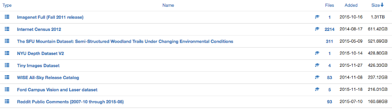
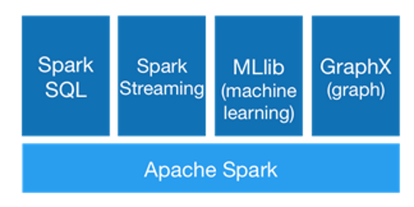
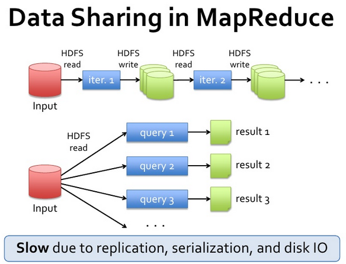
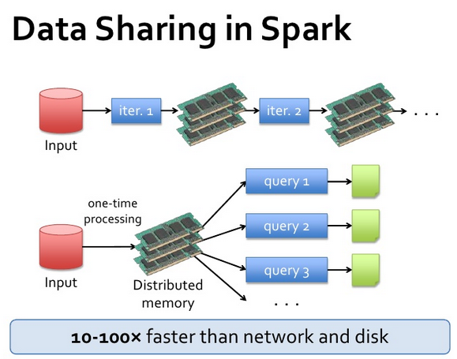
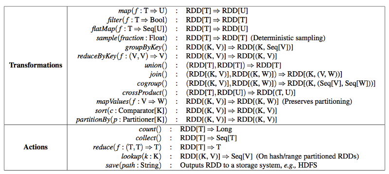
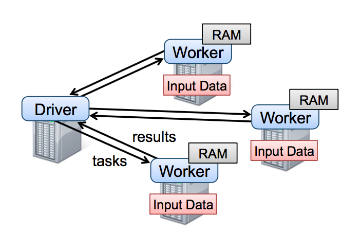

## Course Logistic

* Slides: http://nikolaypavlov.github.io/da-workshops-10/
* Skype Chat: https://join.skype.com/gjN0CfAd4bhg
* [data.table cheat sheet](https://s3.amazonaws.com/assets.datacamp.com/img/blog/data+table+cheat+sheet.pdf)
* [data.table wiki](https://github.com/Rdatatable/data.table/wiki/Getting-started)
* [Benchmarks data.table vs dplyr vs pandas](https://github.com/Rdatatable/data.table/wiki/Benchmarks-%3A-Grouping)
* [Spark Documentation](http://spark.apache.org/docs/latest/)
* Clone [my repo](https://github.com/nikolaypavlov/da-workshops-10) using git or [download in ZIP format](https://github.com/nikolaypavlov/da-workshops-10/archive/gh-pages.zip)
* Install the following packages: spark, sparkR, data.table, hflights

---
## Topics

* Why Big Data is an issue? 
* Intro to the data.table
* What is Spark?
* SparkR

---
## Why Big Data is an issue? 



[[Academic Torrents](http://academictorrents.com/browse.php?sort_field=size&sort_dir=DESC)]


---
## Why Big Data is an issue? 


```r
library(hflights)
object.size(hflights)
```

```
## 24738416 bytes
```

* What if you try to compute dist(hflights)? DON'T DO THIS :) 

$$227496 \times 227496 \times 8 \text{bytes} \sim 414 \text{Gb}$$

---
## Why to choose data.table?

### Pros

* Passing by reference vs passing by value 
* Very fast
* Compatable with Data Frame

### Const

* DT must fit in RAM
* Need to learn new syntax

---
## data.table syntax


```r
DT[i, j, by] 
```

In SQL terminology: 
* i - corresponds to WHERE
* j - corresponds to SELECT
* by - GROUP BY

"Take DT, subset the rows using i, then calculate j, grouped by by"

---
## data.table i, j, by


```r
library(data.table)
DT <- as.data.table(hflights)
DT[Month==10, mean(na.omit(AirTime)), by=UniqueCarrier]
```

```
##     UniqueCarrier        V1
##  1:            AA  68.76471
##  2:            AS 255.29032
##  3:            B6 176.93548
##  4:            CO 141.52861
##  5:            DL  92.76824
##  6:            WN  87.14947
##  7:            XE  82.44422
##  8:            OO 114.98865
##  9:            UA 166.18354
## 10:            US 137.46078
## 11:            EV 113.12273
## 12:            F9 126.55357
## 13:            FL  90.85561
## 14:            MQ 100.13054
```

---
## The i part

### Used to subset on rows


```r
DT[3:5,]
DT[UniqueCarrier == "AA"]
DT[.N-1]
```

---
## The j part

### Used to select columns and apply functions


```r
DT[, mean(na.omit(DepDelay))]
```

```
## [1] 9.444951
```

### Do somthing with several columns using .()


```r
DT[, .(departure=mean(na.omit(DepDelay)), arrival=mean(na.omit(ArrDelay)))]
```

```
##    departure  arrival
## 1:  9.444951 7.094334
```

---
## The by part


```r
DT[, mean(na.omit(DepDelay)), by=Origin]
```

```
##    Origin        V1
## 1:    IAH  8.436951
## 2:    HOU 12.837873
```


```r
DT[, .(AVG_delay = mean(na.omit(DepDelay))), by=.(Origin, Weekend = DayOfWeek >= 6)]
```

```
##    Origin Weekend AVG_delay
## 1:    IAH    TRUE  8.286543
## 2:    IAH   FALSE  8.492484
## 3:    HOU    TRUE 10.965384
## 4:    HOU   FALSE 13.433994
```

---
## In-place update with :=

### Add new column

```r
DT[, Discrete_Distance  := cut(Distance, breaks=20)]
```

### Update existing column


```r
DT[, ActualElapsedTime := ActualElapsedTime / 60]
```

### Remove multiple columns


```r
DT[, c("TaxiIn", "TaxiOut") := NULL]
```

---
## Indexing and keys


```r
setkey(DT, Year, Month)
DT[.(2011, c(3,4,5)), sum(Cancelled)]
```

```
## [1] 689
```


```r
DT[.(2011, c(3,4,5)), sum(Cancelled), by=.EACHI]
```

```
##    Year Month  V1
## 1: 2011     3 159
## 2: 2011     4 251
## 3: 2011     5 279
```

---
## Advanced function application with .SD


```r
DT[, lapply(.SD[, .(AirTime, ArrDelay, DepDelay)], mean, na.rm=T), by=.(Year, Month)]
```

```
##     Year Month  AirTime  ArrDelay  DepDelay
##  1: 2011     1 104.1106  4.926065  7.930889
##  2: 2011     2 105.0597  6.349233  9.244213
##  3: 2011     3 108.2009  7.892718  9.746544
##  4: 2011     4 109.2508 11.088744 10.507546
##  5: 2011     5 110.3382 13.125916 12.198561
##  6: 2011     6 110.2511 10.836983 12.177978
##  7: 2011     7 109.2059  9.623474 12.451282
##  8: 2011     8 108.3067  4.533096  7.648850
##  9: 2011     9 107.8786  4.243050  6.332387
## 10: 2011    10 107.9135  3.723636  6.807661
## 11: 2011    11 107.5924  3.221324  6.732064
## 12: 2011    12 108.9317  5.013244 10.992983
```

---
## Exercise

* Find the worst carrier in terms of average arrival delay.


* Which day of week is on average the busiest in terms of departure delays in the George Bush Intercontinental airport (IAH)? 


---
## What is Spark?

Apache Spark is a fast and general engine for large-scale data processing



---
## What is Spark?

Spark runs on Hadoop, Mesos, standalone, or in the cloud. It can access diverse data sources including HDFS, Cassandra, HBase, and S3.


---
## Hadoop vs Spark



[[Spark and Shark: Lightning-Fast Analytics over Hadoop and Hive Data](http://www.slideshare.net/jetlore/spark-and-shark-lightningfast-analytics-over-hadoop-and-hive-data)]

---
## Hadoop vs Spark



[[Spark and Shark: Lightning-Fast Analytics over Hadoop and Hive Data](http://www.slideshare.net/jetlore/spark-and-shark-lightningfast-analytics-over-hadoop-and-hive-data)]

---
## Programming Model:

Spark provides two main abstractions for parallel programming: 
* resilient distributed datasets (RDD) 
* parallel operations on these datasets

---
## Parallel operations



[Matei Zaharia, Mosharaf Chowdhury, Tathagata Das, Ankur Dave, Justin Ma, Murphy McCauley, Michael J. Franklin, Scott Shenker, Ion Stoica. "Resilient Distributed Datasets: A Fault-Tolerant Abstraction for In-Memory Cluster Computing"]

---
## Spark runtime



---
## Available APIs

* [Scala](https://spark.apache.org/docs/latest/api/scala/index.html#org.apache.spark.package)
* [Java](https://spark.apache.org/docs/latest/api/java/index.html)
* [Python](https://spark.apache.org/docs/latest/api/python/index.html)
* [R](https://spark.apache.org/docs/latest/api/R/index.html)

---
## Examples in spark_examples.r


---
## Course Logistic

* Slides: http://nikolaypavlov.github.io/da-workshops-10/
* Skype Chat: https://join.skype.com/gjN0CfAd4bhg
* [data.table cheat sheet](https://s3.amazonaws.com/assets.datacamp.com/img/blog/data+table+cheat+sheet.pdf)
* [data.table wiki](https://github.com/Rdatatable/data.table/wiki/Getting-started)
* [Benchmarks data.table vs dplyr vs pandas](https://github.com/Rdatatable/data.table/wiki/Benchmarks-%3A-Grouping)
* [Spark Documentation](http://spark.apache.org/docs/latest/)
* Install the following packages: spark, sparkR, data.table, hflights

---
## We are hiring! 

### If you like Data Analysis, please drop me your CV at mykola@azzurro.io
